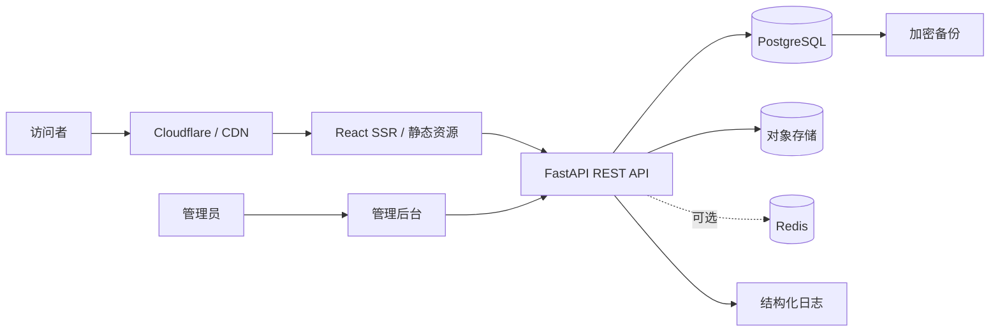
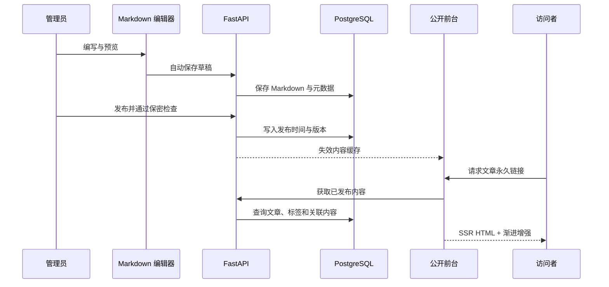
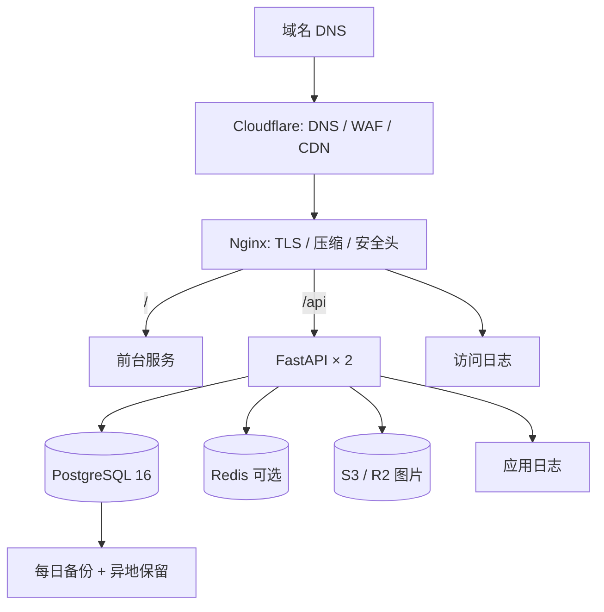

# 系统、数据库与接口设计

## 1. 最终技术方案

公开前台采用 React + TypeScript + Vinext/Vite。Vinext 保留 React 组件模型和 Vite 开发体验，同时支持服务端渲染及 Cloudflare Worker 兼容输出。后台采用 FastAPI + SQLAlchemy + Pydantic + Alembic + PostgreSQL；Redis 仅在需要登录限流、热门缓存和任务队列时启用。

不改为纯静态生成器的原因：管理后台、预览、搜索和动态设置需要 API；不使用单体全栈框架的原因：Python 工具生态与现有测试技能更匹配，前后端独立演进更清晰。

## 2. 系统架构

## 3. 内容数据流

## 4. 部署架构

## 5. 数据库设计

通用字段：除纯关联表外均包含 `id uuid PK`、`created_at timestamptz NOT NULL default now()`、`updated_at timestamptz NOT NULL default now()`；内容实体包含 `deleted_at timestamptz NULL` 用于软删除。所有时间以 UTC 存储。

| 表 | 关键字段（类型 / 空值 / 默认） | 索引与约束 | 外键 |
|---|---|---|---|
| users | email varchar(254) NN；password_hash varchar NN；display_name varchar NN；role varchar NN `admin`；is_active bool NN `true`；last_login_at timestamptz NULL | email UNIQUE；is_active index | — |
| posts | title varchar(180) NN；slug varchar(200) NN；summary text NN；content_md text NN；cover_media_id uuid NULL；category_id uuid NULL；status varchar NN `draft`；published_at timestamptz NULL；seo_title varchar NULL；seo_description varchar NULL；view_count bigint NN `0` | slug UNIQUE；status+published_at index；GIN search vector | users.id(author_id)、categories.id、media_files.id |
| categories | name varchar(80) NN；slug varchar(100) NN；description text NULL；sort_order int NN `0` | name/slug UNIQUE；sort_order index | self parent_id |
| tags | name varchar(80) NN；slug varchar(100) NN | name/slug UNIQUE | — |
| post_tags | post_id uuid NN；tag_id uuid NN | PK(post_id,tag_id)；tag_id index | posts.id、tags.id CASCADE |
| projects | title varchar(180) NN；slug varchar(200) NN；summary text NN；content_md text NN；status varchar NN；started_at date NULL；ended_at date NULL；repo_url varchar NULL；demo_url varchar NULL；featured bool NN `false`；sort_order int NN `0` | slug UNIQUE；featured+sort_order index | users.id(owner_id)、media_files.id |
| project_tags | project_id uuid NN；tag_id uuid NN | PK(project_id,tag_id) | projects.id、tags.id CASCADE |
| timelines | event_date date NN；title varchar(180) NN；description text NN；event_type varchar NN；is_public bool NN `true`；sort_order int NN `0` | event_date DESC index；is_public index | — |
| media_files | storage_key varchar(500) NN；original_name varchar(255) NN；mime_type varchar(120) NN；size_bytes bigint NN；width int NULL；height int NULL；alt_text varchar NULL；checksum varchar(64) NN | storage_key/checksum UNIQUE；mime_type index | users.id(uploader_id) |
| site_settings | key varchar(120) NN；value_json jsonb NN `{}`；is_public bool NN `false` | key UNIQUE | users.id(updated_by) |
| links | name varchar(120) NN；url varchar(2048) NN；description text NULL；status varchar NN `active`；sort_order int NN `0` | status+sort_order index；url UNIQUE | — |
| operation_logs | actor_id uuid NULL；action varchar(120) NN；resource_type varchar(80) NN；resource_id uuid NULL；ip_hash varchar(64) NULL；detail_json jsonb NN `{}` | created_at DESC；actor+created_at | users.id SET NULL |
| comments | post_id uuid NN；author_name varchar NN；author_email_hash varchar(64) NN；content text NN；status varchar NN `pending`；parent_id uuid NULL | post+status+created index | posts.id、self parent_id |
| page_views | path varchar(500) NN；content_type varchar(40) NULL；content_id uuid NULL；visitor_hash varchar(64) NULL；referer_host varchar NULL；viewed_at timestamptz NN | path+viewed_at；content_id | 无硬外键，便于分区 |

软删除查询默认加 `deleted_at IS NULL`。恢复只允许管理员；超过 30 天的软删除记录由维护任务物理清理，操作日志不软删除。

## 6. Markdown 与文件

- 数据库存储原始 Markdown 和可选的渲染缓存，不把 HTML 作为唯一事实来源。
- Markdown 解析支持 GFM、代码高亮、KaTeX 和 Mermaid；禁用任意脚本与事件属性。
- 图片原文件进入对象存储；数据库保存元数据、校验和、替代文本和派生尺寸。
- 上传后生成 AVIF/WebP/JPEG 多尺寸；正文使用 `srcset` 和懒加载。

## 7. 搜索与缓存

- MVP：PostgreSQL 标题、摘要、标签和项目字段的加权搜索。
- 中文正文规模扩大后评估 PGroonga 或独立 Meilisearch。
- CDN：指纹静态资源一年 immutable；公开 HTML 短缓存并支持 stale-while-revalidate。
- API：文章详情 5 分钟、列表 60 秒；发布、更新和删除后按内容键主动失效。
- Redis 只缓存可重建结果，不缓存权限判断的最终结果。

## 8. 认证、安全和异常

- 密码使用 Argon2id；登录失败按账户和 IP 双维度限流。
- 浏览器会话采用 HttpOnly、Secure、SameSite=Lax Cookie；写请求校验 CSRF Token。
- 管理接口要求 `admin` 角色；公开接口只返回 `published` 数据。
- Pydantic 做输入校验，SQLAlchemy 参数化查询，输出前统一序列化。
- 错误响应：`{"success":false,"error":{"code":"POST_NOT_FOUND","message":"...","request_id":"..."}}`。
- 日志使用 JSON，包含 request_id、method、path、status、duration_ms；不记录密码、Cookie、Token、正文与原始个人信息。

## 9. REST API

统一前缀 `/api/v1`。分页响应为 `{"success":true,"data":[],"meta":{"page":1,"page_size":20,"total":0}}`。

| 方法与路径 | 请求 | 响应 | 权限 |
|---|---|---|---|
| POST `/auth/login` | email, password, csrf_token | 当前用户；设置会话 Cookie | 公开/限流 |
| POST `/auth/logout` | CSRF Header | 204 | 已登录 |
| GET `/auth/me` | — | 用户资料 | 已登录 |
| GET `/posts` | page, page_size, category, tag, q, sort | 已发布文章列表 | 公开 |
| GET `/posts/{id_or_slug}` | — | 文章、标签、相邻文章 | 公开 |
| POST `/admin/posts` | 文章创建体 | 新文章 | 管理员 |
| PATCH `/admin/posts/{id}` | 部分字段、version | 更新文章 | 管理员 |
| DELETE `/admin/posts/{id}` | — | 204 软删除 | 管理员 |
| POST `/admin/posts/{id}/publish` | publish_at 可选 | 发布结果 | 管理员 |
| GET/POST `/admin/categories` | 筛选 / 分类体 | 分类列表 / 分类 | 管理员 |
| PATCH/DELETE `/admin/categories/{id}` | 分类体 | 分类 / 204 | 管理员 |
| GET/POST `/admin/tags` | 筛选 / 标签体 | 标签列表 / 标签 | 管理员 |
| PATCH/DELETE `/admin/tags/{id}` | 标签体 | 标签 / 204 | 管理员 |
| GET `/projects` | page, status, tag | 项目列表 | 公开 |
| GET `/projects/{slug}` | — | 项目详情 | 公开 |
| POST/PATCH/DELETE `/admin/projects[/{id}]` | 项目体 | 项目 / 204 | 管理员 |
| GET `/timelines` | year, type | 公开时间线 | 公开 |
| POST/PATCH/DELETE `/admin/timelines[/{id}]` | 时间线体 | 事件 / 204 | 管理员 |
| POST `/admin/media` | multipart file, alt_text | 媒体元数据 | 管理员 |
| GET `/search` | q, type, category, tag, page | 高亮结果 | 公开 |
| GET `/settings/public` | — | 公开设置 | 公开 |
| GET/PATCH `/admin/settings` | — / settings map | 设置 | 管理员 |
| POST `/analytics/views` | path, content_id | 202 | 公开/限流 |
| GET `/admin/analytics/overview` | from, to | 汇总 | 管理员 |
| POST `/admin/backups` | mode | 备份任务 | 管理员 |
| GET `/admin/backups` | page | 备份记录 | 管理员 |
| POST `/admin/backups/{id}/restore` | confirm phrase | 恢复任务 | 超级管理员 |

常用错误码：`VALIDATION_ERROR` 422、`AUTH_REQUIRED` 401、`INVALID_CREDENTIALS` 401、`FORBIDDEN` 403、`NOT_FOUND` 404、`SLUG_CONFLICT` 409、`VERSION_CONFLICT` 409、`UPLOAD_TYPE_DENIED` 415、`UPLOAD_TOO_LARGE` 413、`RATE_LIMITED` 429、`INTERNAL_ERROR` 500。

## 10. SEO

- 每页独立 title、description、canonical、Open Graph 和 Twitter Card。
- 文章使用 `Article` JSON-LD；个人页使用 `Person`；项目页使用 `SoftwareSourceCode`。
- 稳定 URL 使用英文 slug；已发布 slug 修改时写入重定向表并返回 301。
- 自动生成 Sitemap、RSS 和 robots；后台禁止抓取。
- 404 返回真实 404 状态；域名和协议统一 301 到主 Canonical。
- Search Console、Bing Webmaster 和站点验证值由环境变量配置。

## 11. 扩展策略

业务逻辑留在服务层；接口做版本前缀；搜索、对象存储、邮件和评论均通过端口适配器隔离。流量增长后可独立拆分图片处理和搜索服务，而不修改内容模型。
