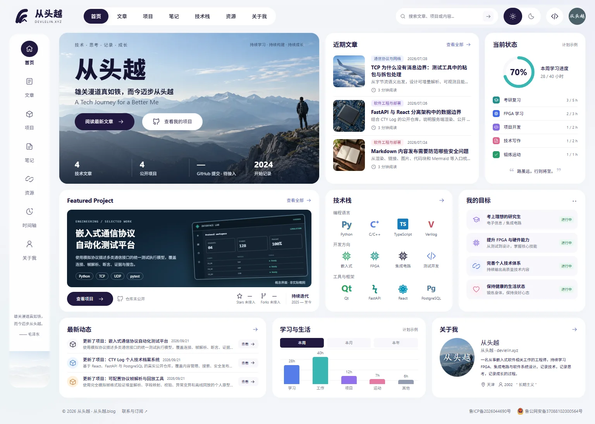
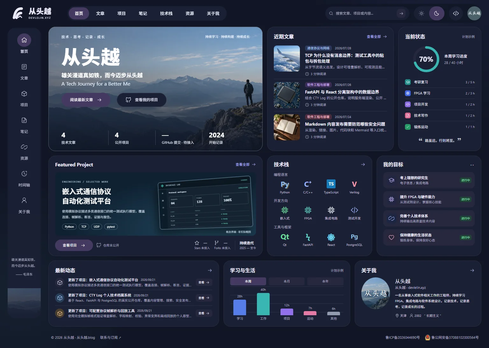
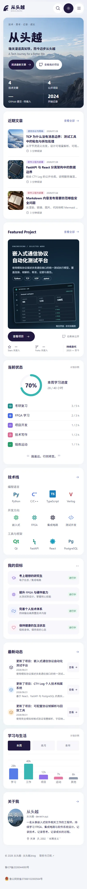

# 首页 UI 重构交付记录

日期：2026-09-22。工作分支：`feature/home-bento-redesign`。本轮包含首页重构与个人标识统一，发布状态以对应 PR、Release 和服务器记录为准。

## 实现范围

以 1536px 桌面参考图为优先，完成 Design Token、顶部导航、桌面侧栏、移动导航抽屉和三行 Bento Grid。首页包含 Hero、近期文章、当前状态、精选项目、技术栈、目标、最新动态、学习与生活、关于我九个区域。完成平板/手机重排、深色模式、键盘焦点、抽屉焦点约束与恢复、减少动画支持。

沿用现有 React/Vinext SSR、API、主题存储、SEO、Markdown、文章/项目详情、搜索和后台。没有修改数据库模型、迁移或后端源文件；没有实现通知系统。备案与联系入口保留。

## 文件清单

| 文件 | 作用 |
| --- | --- |
| `app/page.tsx` | 首页服务端获取真实文章、项目、时间轴，组合九个区域 |
| `app/home.css` | 首页及导航设计变量、桌面布局、响应式和深色样式 |
| `app/globals.css` | 引入首页样式，清理被替代的旧首页/外壳规则 |
| `app/layout.tsx` | 显式设置现有 favicon，消除浏览器图标 404 |
| `app/sitemap.ts` | 补充笔记、资源路由 |
| `app/notes/page.tsx` | 使用真实文章搜索的笔记入口与分页 |
| `app/resources/page.tsx` | 使用真实公开链接的资源入口 |
| `components/SiteFrame.tsx` | 保留主题与页脚，整合导航和抽屉交互 |
| `components/layout/Navigation.tsx` | 顶部、侧栏、移动导航，真实搜索与后台入口 |
| `components/ui/Icon.tsx` | 轻量 SVG 图标集合 |
| `components/home/CoreCards.tsx` | Hero、文章、状态、共享标题 |
| `components/home/FeaturedProject.tsx` | 真实精选项目及无截图时的概念示意 |
| `components/home/ProfileCards.tsx` | 技术栈、目标、真实动态、个人介绍 |
| `components/home/LearningOverview.tsx` | 明确标为计划示例的周期切换图表 |
| `data/home.ts` | 个人文案、导航、技术栈、目标、计划示例、备用图片 |
| `public/home/*.webp` | 四张压缩后的装饰图片 |
| `tests/home-components.test.tsx` | 数据真实性边界、空态、封面优先级、示例图表测试 |
| `tests/frontend-components.test.tsx` | 主题、导航、抽屉焦点、原有页脚等回归 |
| `tests/rendered-html.test.mjs` | SSR 文案及新增路由检查，保留安全与 RSS 回归 |
| `tests/e2e/public-site.spec.ts` | 导航、断点、主题、搜索、无障碍浏览器测试 |
| `docs/HOME_UI_REDESIGN.md` | 本交付说明与图片生成记录 |

## 数据来源

**现有真实 API：**文章标题、摘要、分类、日期、阅读时长、封面与总数；项目标题、摘要、标签、状态、周期、封面、仓库链接与总数；时间轴。最新动态根据文章、项目和时间轴的实际记录组织，不伪装 GitHub 推送。公共站点设置及公开链接仍来自已有接口。

**本地配置：**个人文案、技术栈、目标、开始记录年份、导航和图片回退。学习进度与时长明确显示“计划示例”，不是计时统计。GitHub 提交、Stars、Forks 缺失时显示待接入/未接入，不填虚构数字。仓库未提供时显示“仓库未公开”。

预览截图使用本地 FastAPI 与隔离 SQLite 中的项目种子内容；跨栈测试使用单独临时数据库。这证明真实接口链路可用，不表示已读取或验证生产数据库内容。

## 素材及视觉差异

- `public/home/mountain-journey.webp`：AI 生成的山景装饰图，约 93 KB，用于 Hero 与个人卡片背景。
- `public/home/flight.webp`、`chip.webp`、`notebook.webp`：AI 生成的文章备用装饰封面，共约 41 KB。文章有 API 封面时优先使用 API 封面。
- 精选项目缺少真实截图时使用 CSS 概念界面，页面明确标注“概念界面 · 非实际截图”；接入真实封面后自动替换。
- 个人姓名、顶部头像与右下角头像均使用“从头越”；头像是文字与山景的组合，需要真实头像时可替换。品牌与技术图标采用轻量图形/文字近似，并非参考图原始素材。
- 参考图中的演示文章、EITS 项目名称及统计未照抄为真实内容；实际内容长度会导致局部排版与参考图存在差异。当前完成布局、比例、配色与层级还原，不声称逐像素一致。

## 验证结果

| 检查 | 结果 |
| --- | --- |
| TypeScript `typecheck` | 通过 |
| ESLint | 通过，0 警告、0 错误 |
| 生产 `build` | 通过 |
| Node SSR/安全/RSS/包体预算测试 | 8/8 通过 |
| Vitest 组件测试 | 14/14 通过 |
| 真实 FastAPI → 生产 SSR 集成 | 通过，隔离临时数据库 |
| 生产模式 Playwright | 6/6 通过 |
| 断点检查 | 320、375、390、768、1024、1279、1280、1440、1536、1920px 无横向溢出 |
| 截图与 axe | 1536 明暗、1280/1024/768/390 明、375 暗，7 组均无扫描违规 |
| 浏览器 console/pageerror | 上述本地页面检查未发现错误 |
| `git diff --check` | 通过 |

SSR 浏览器测试显式等待内容出现后检查布局，避免把流式加载壳误当作最终页面。生产本地测试沿用仓库既有的 Windows standalone 静态资源路径兼容处理，仅作用于生成物。包体预算通过；本轮没有提供 Lighthouse 分数，也未做生产网络性能验收。

最终截图和机器检查结果在本地忽略目录 `work/home-qa/`：`home-1536-light.png`、`home-1536-dark.png`、`home-390-light.png`、`audit.json`。

## 图片生成记录

生成方式：内置 ImageGen（非外部抓取）；生成后以 Sharp 压缩为 WebP。原始 PNG 位于 `C:/Users/17748/.codex/generated_images/01a0c451-6983-7022-9714-e6c7bc44d53a/`。生成装饰图不代表真实项目、人物或文章实物摄影。

### Hero prompt

Use case: photorealistic-natural. Asset type: wide background photograph for a refined personal engineering blog hero. Create a cinematic natural mountain panorama, landscape 16:9. Layered blue grey alpine peaks receding into atmospheric mist, pale powder blue sky occupying upper third, crisp rocky ridge in lower right. One small anonymous hiker in dark jacket with backpack seen entirely from behind on the far right edge, looking toward distant mountains, occupying less than 15 percent of width. Left two thirds must be calm pale sky and softly layered mountains with ample negative space to place dark navy Chinese headings as live HTML later. Bottom quarter dark slate mountains for white live HTML statistics. Soft morning light, realistic editorial outdoor photography, restrained blue grey palette, natural detailed rock textures, aspirational quiet exploration. No text, no logo, no watermark, no UI, no borders. Do not resemble an advertisement, no orange flares, no dramatic fantasy peaks.

### Flight prompt

Photorealistic editorial closeup of a silver aircraft wing above blue clouds, calm pale blue sky, viewed from passenger window without showing window frame. Square composition suitable as a small thumbnail for an aerospace communication engineering blog. Cool blue grey palette, soft daylight, professional magazine photography. No writing, no logos, no watermark.

### Chip prompt

Photorealistic macro editorial photograph of a dark blue printed circuit board with a single square FPGA chip in center, fine silver traces and solder details. Chip has no writing, no trademarks. Diagonal composition, soft studio lighting, navy and slate grey restrained colors, realistic engineering hardware, square thumbnail. No text, no logo, no watermark.

### Notebook prompt

Photorealistic overhead editorial photograph of an open cream notebook with fine faint ruled lines on a dark walnut desk, black fountain pen placed diagonally alongside it, soft afternoon window lighting, subtle warm neutral palette. Square thumbnail for a personal technical writing and learning blog, quiet thoughtful mood, no readable writing, no logos, no watermark.

## 最终视觉预览

以下截图使用本地隔离数据库内容，姓名及头像统一为“从头越”。

