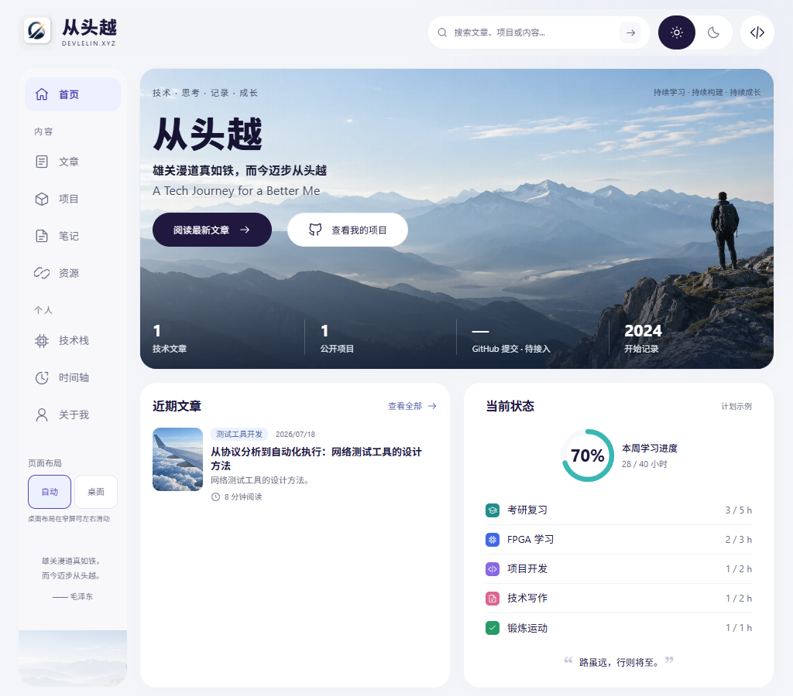
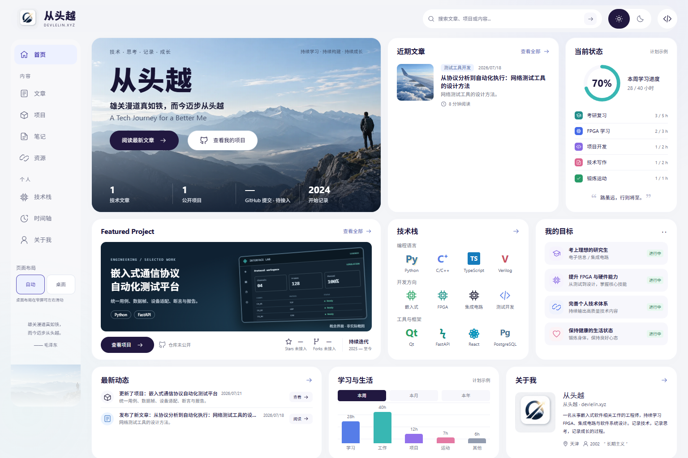
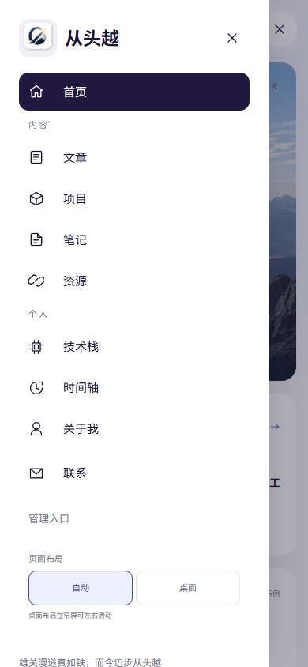
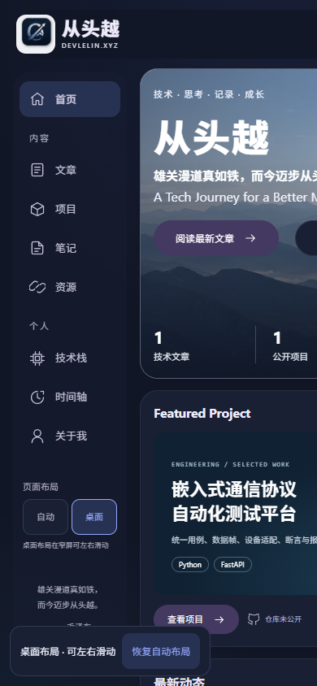

# 导航与页面布局

顶部提供品牌标识、搜索与工具；左侧统一显示首页、内容和个人栏目。页面整体居中，最大宽度保持 1648px。

- 自动布局：1024px 起常驻左侧导航；768–1279px 首页主要使用双列；不足 768px 使用单列；不足 1024px 通过顶部按钮打开导航。
- 桌面布局：在侧栏或手机导航底部选择“桌面”，页面画布至少为 1280px，窄屏可左右滑动。选择保存在浏览器本地，跳转和刷新后继续生效。
- 恢复自动：侧栏可选择“自动”；窄屏另有跟随可见区域的“恢复自动布局”按钮。
- 无法使用本地存储时，当前页面仍可切换，但刷新后恢复自动布局。
- 所有尺寸保留九个首页模块及一致的内容顺序，标题辅助文字和目标状态不再因宽度被隐藏。窄屏管理入口移至导航抽屉。
- 品牌原图来源见 [BRAND_ASSETS.md](BRAND_ASSETS.md)。

## 验证

通过 lint、TypeScript、生产构建、8 项服务端渲染/包体积测试、15 项组件测试，以及 13 项浏览器测试。浏览器检查覆盖 320–2560px、1024px 侧栏断点、键盘焦点、主题、布局记忆及触屏模拟下刷新后恢复自动布局。另验证了禁用本地存储时的切换。

以下截图来自本地构建和测试数据，不代表生产内容或真实手机验收。

